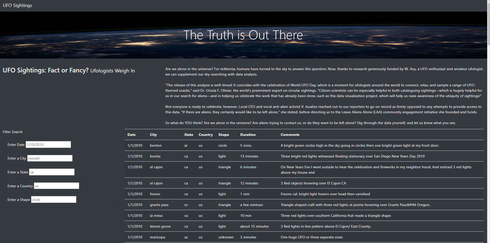
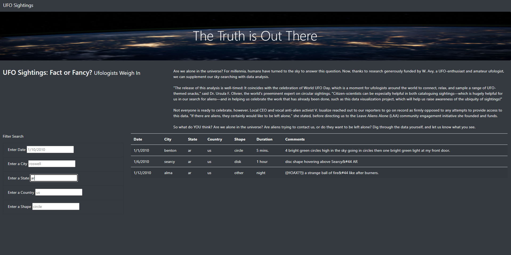
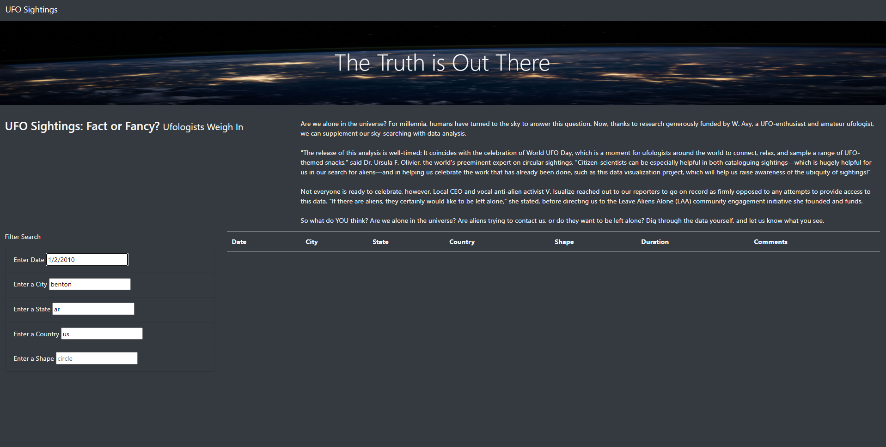
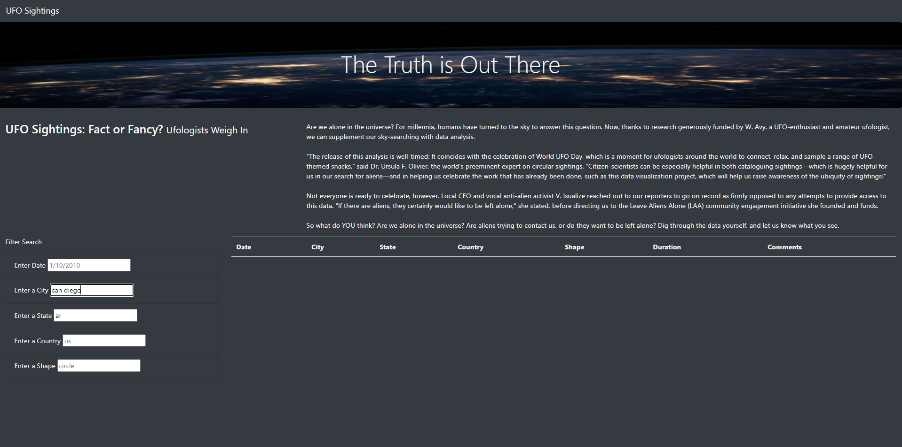
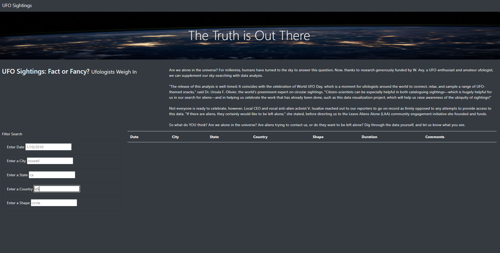
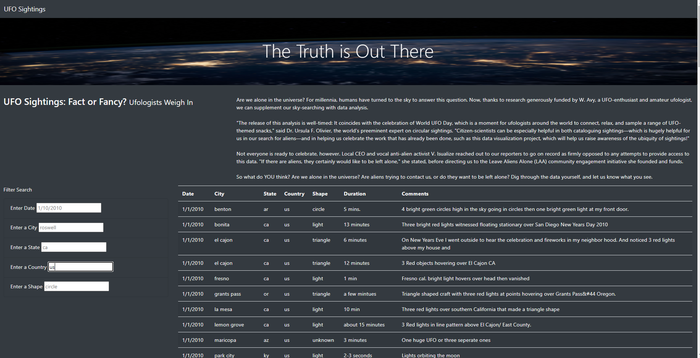

# UFOs

## Overview of Project
The project is help Dana, a data journalist, to create a html page which display her UFO article, and a table of data which support the findings.
We need to apply Javascript skill to provide a dynamic table that allowing users filters for multiple criteria at the same time. 
Users might input any specific date, city, state, country and shape, the corresponding data will be shown on the webpage.

## Results

* Default page

  The webpage will display in the layout we plotted while storyboarding with additional 4 filters, Enter a City, Enter a State, Enter a Country, Enter a Shape. 
Each filter provides an input box with text in gray shown 1/10/20010 for date, rosewell for city, ca for state, us for country, and circle for shape. 
The gray text are to provide demonstrations for user what kind of format they should input in each filter box.

* Filtered data provided page
  
  After users input the criteria and press enter, the table will show the data fulfilled the criteria. 
Users can enter one or more filters and the table will provide the filtered result.
In the first picture below, you can see that there three data while we filter sightings records in AR state.
In the second picture below, you can see that there is only one data while we add filters as state in AR, city in Benton, country in us and date in 1/1/2010.

* No result page

  There are circumstances that there is no data will be shown after users enter criteria.
In the first picture below, you can see that there is no data if we filter sightings records state in AR, city in Benton, country in us and date in 1/2/2010.
It is because there is no sighting at 1/2/2010. As we filter previously, there is one record while in 1/1/2010 in Benton, AR, US.
In the second picture below, you can see that there is no data if we input the filter state in AR, city in San Diego.
It is because there is no city San Diego in AR.

## Summary

* Drawback

  The major drawback is that the users must input criteria in the format exact match our data source or they will not be able to retrieve data. 
You can see pictures below. If “US” input in country filter, there is no result. If “us” input in country filter, there are many results.

* Two recommendations for further development

   1. We should develop the filter more user friendly and make users retrieve the result in easier steps. We can provide dropdown menus on shape criteria.
In this way, we can prevent users from not retrieving results because of typo. We can make the filter function ignore case so that we can prevent users from not retrieving results because of upper-case input.

   2. We should provide more information when there is no result. Take no result above, if it is no sighting under that specific date, city, state, country, or shape, the page should indicate that there is no sighting record. 
If it is no such city, San Diego, in the state, AR, the page should indicate that there is no such city in the state.

